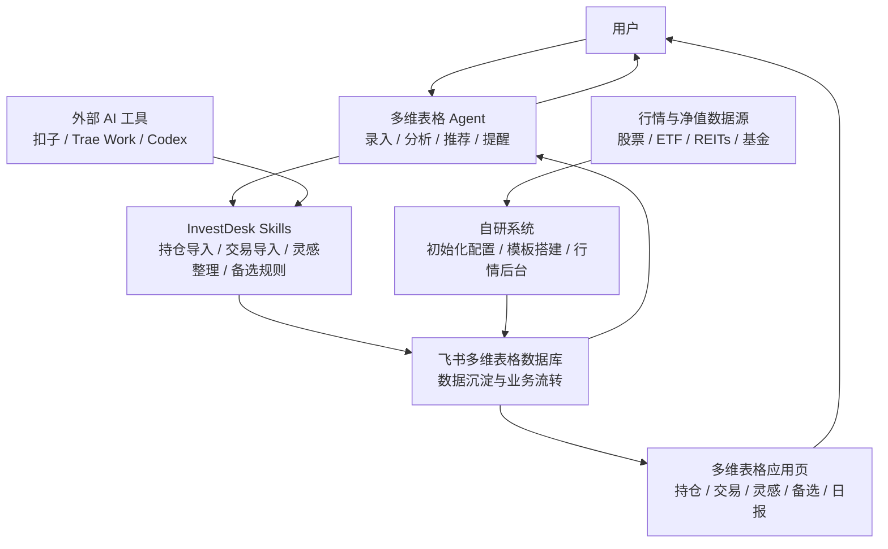

# InvestDesk 架构说明

## 一句话定位

InvestDesk 不是一个从零自建的投资 App，而是一个以飞书多维表格为数据库、应用和 Agent 中枢，以 Skill 作为结构化协议，以自研系统补齐初始化配置和实时行情后台的个人投资管理方案。

## 总体架构

```text
用户
  -> 飞书多维表格 Agent
  -> InvestDesk Skills
  -> 飞书多维表格数据库
  -> 多维表格应用页

自研系统
  -> 飞书初始化配置
  -> 多维表格模板初始化
  -> 定时行情/净值抓取
  -> 写回飞书多维表格

外部 AI 工具（扣子 / Trae Work / Codex）
  -> 可复用同一套 InvestDesk Skills
  -> 写入飞书多维表格
```



## 分层说明

### 多维表格 Agent：主要交互与录入层

多维表格 Agent 是第一阶段的主要交互入口。它负责和用户对话，读取截图、Excel、文本，把非结构化输入整理成标准化数据，并结合多维表格里的用户数据进行分析、推荐和提醒。

典型任务：

- 识别期初持仓
- 识别交易记录
- 整理投资灵感
- 生成备选池触发规则
- 按固定字段格式输出
- 调用 InvestDesk Skill 写入多维表格
- 持仓分析
- 持仓动态日报
- 备选池条件触发判断
- 回答“这件事和我有什么关系”

这层适合处理“需要结合用户数据库”的录入、检索和分析任务。

### 外部 AI 工具：可选输入入口

外部 AI 工具包括扣子、Trae Work、Codex 等。它们不是第一阶段主界面，但可以复用同一套 InvestDesk Skills，把用户上传的文件、截图、文本和投资想法结构化后写入飞书多维表格。

外部 AI 工具适合：

- 在非飞书环境里录入数据
- 复用已有 Agent 能力
- 做 Skill 开发、调试和批处理
- 在多维表格 Agent 能力不足时提供备用入口

### Skill：结构化协议层

Skill 负责约束 Agent 输出，避免数据随意进入表格。多维表格 Agent 和外部 AI 工具都可以通过同一套 Skill 生成一致的数据格式。

需要沉淀的 Skill：

- 持仓导入 Skill
- 交易记录导入 Skill
- 投资灵感整理 Skill
- 备选池规则生成 Skill
- 飞书多维表格写入 Skill

Skill 的核心价值不是“回答得更像人”，而是让 Agent 输出符合多维表格字段协议，并在写入前保留可确认、可追溯的结构化结果。

### 飞书多维表格数据库：数据沉淀与业务流转层

所有长期数据都沉淀在飞书多维表格里。它是 InvestDesk 的事实数据库，也是表格之间业务流转的承载层。

核心数据表：

- 持仓表
- 交易记录表
- 灵感池
- 备选池 / 条件触发池
- 价格快照表
- 提醒记录表
- 每日摘要表

数据表页负责业务事实和规则的维护，例如字段、关联、公式、筛选、状态流转。实时持仓计算优先通过业务流程、公式、关联和自动化在多维表格中实现。

### 多维表格应用页：可视化层

多维表格应用页是第一阶段的主要用户界面。它负责把 Base 数据组织成可以日常查看和操作的业务界面。

应用页包括：

- 持仓一览
- 交易记录一览
- 灵感股
- 备选股
- 条件触发提醒
- 持仓动态日报

因此，自建前端不作为第一阶段主业务界面。第一阶段优先使用多维表格应用页降低开发和维护成本。

### 自研系统：基础设施层

自研系统不作为主要日常使用界面，而是负责飞书配置、模板初始化和行情后台。

典型能力：

- 飞书 App 初始化配置
- 用户授权与 Base token 配置
- 多维表格模板初始化
- 表、字段、视图、应用页初始化
- 定时抓取股票、ETF、REITs、基金净值
- 写入价格快照表
- 更新备选池触发状态

实时行情和净值获取是否能由多维表格 Agent 稳定完成还不确定，因此这部分仍放在自研系统中。当前 Next.js 项目可以逐步调整为初始化后台、worker 控制台和开发验证页。

## 数据流

### 用户输入数据流

```text
截图 / Excel / 文本 / 投资想法
  -> 多维表格 Agent 对话
  -> Skill 结构化
  -> 用户确认
  -> 写入飞书多维表格
  -> 多维表格应用页展示
  -> 多维表格 Agent 分析
```

外部 AI 工具也可以复用同一条 Skill 链路：

```text
截图 / Excel / 文本 / 投资想法
  -> 外部 AI 工具（扣子 / Trae Work / Codex）
  -> InvestDesk Skill 结构化
  -> 飞书 CLI / 飞书 Skill 写入多维表格
```

### 行情数据流

```text
行情 / 净值 / 指数 / 板块数据
  -> 自研系统定时抓取
  -> 写入价格快照表
  -> 更新持仓估值和触发状态
  -> 应用页展示
  -> Agent 生成分析和日报
```

## 核心业务对象

### 持仓表

记录当前已经持有的资产。它不应完全依赖手工维护，而应由期初持仓、交易记录和最新价格共同计算或同步出来。

### 交易记录表

记录资产变化流水，是持仓变化的依据。买入、卖出、分红、转入、转出都放在这里。

### 灵感池

记录个人见闻、AI 对话、新闻、思考形成的投资观点。它回答“我为什么关注这个标的”。

### 备选池 / 条件触发池

备选池不是普通 watchlist，而是条件触发池。它回答“什么条件满足后，需要提醒我考虑买入、卖出、加仓、减仓或复盘”。

示例：

```text
标的：沪深300ETF
动作：考虑买入
条件：大盘持续下跌 10 天
提醒：条件满足后提醒用户复核，而不是自动给出交易指令
```

### 价格快照表

记录每次行情或净值抓取结果。每次抓取应新增快照，而不是只覆盖旧值。

### 提醒记录表

记录备选池条件触发、持仓异动、灵感验证等提醒结果。

### 每日摘要表

沉淀每日持仓动态日报，包括大盘摘要、板块摘要、持仓和关注标的摘要、AI 解读和待办动作。

## 第三板块定位

每日摘要不应该替代券商软件。券商软件已经更擅长实时行情、全市场资讯、K 线、盘口、资金流和交易功能。

InvestDesk 的每日摘要只做一件事：

> 回答“今天市场发生的事，和我的持仓、灵感、备选规则有什么关系？”

因此，第三板块重点是：

- 与持仓相关的日终变化
- 与观察/备选标的相关的异动
- 与投资灵感相关的验证或削弱信号
- 跨平台组合影响
- 复盘提醒和待办

不做：

- 实时行情终端
- 全市场新闻聚合
- 复杂技术分析
- 替代券商研报
- 高频交易提醒

## 核心原则

- 数据不散落在聊天里，统一沉淀到飞书多维表格。
- 多维表格 Agent 是第一阶段的主要录入、检索、分析和提醒入口。
- Skill 是跨多维表格 Agent 和外部 AI 工具复用的结构化协议层。
- 多维表格应用页优先作为第一阶段主界面。
- 自研系统只补飞书多维表格和 Agent 不擅长或不稳定的能力：初始化、模板搭建、行情定时更新。
- 不做券商软件已经很强的实时行情终端，只做“和我的持仓、灵感、备选规则有关”的投资上下文管理。

## 当前结论

InvestDesk 的新架构是：

> 用多维表格 Agent 完成主要录入、检索、分析和提醒，用 Skill 保证结构化，用飞书多维表格沉淀数据并实现业务流转，用多维表格应用页展示，用自研系统负责初始化和实时行情更新；外部 AI 工具作为可复用 Skill 的可选入口。
